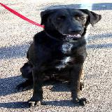
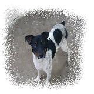
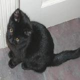
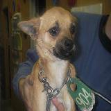
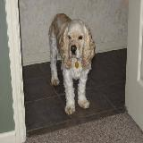
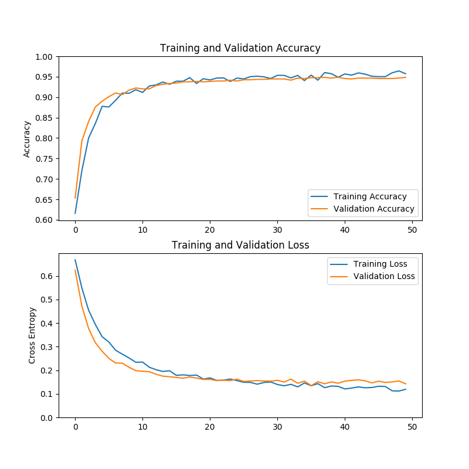
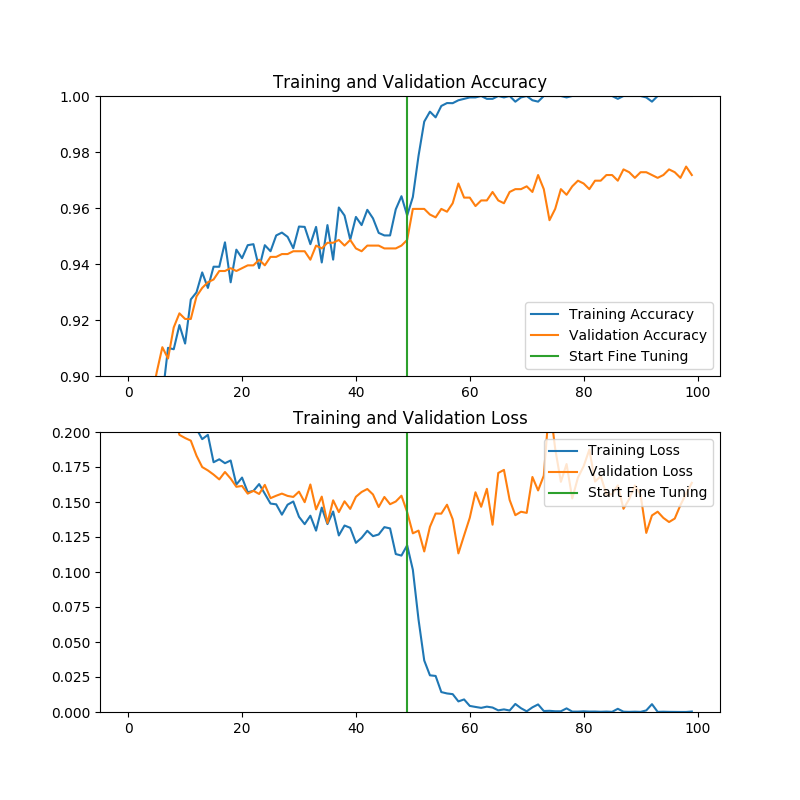

# Transfer Learning with Tensorflow 2.0 Using Pretrained ConvNets

This is a simple experiment with copied code to check my local installation of tensorflow 2.0 alpha running on an Nvidia GTX 1060 (6MB).  
Two things are illustrated:
* a pretrained network can be adapted to a new task very quickly by freezing its weighs and onls replacing and traing the output layers.
* the obtained accuracy can be substantially increased by retraining a fraction of the layers with a very small learning rate.

Total training time was 11 min
## task
Separate dogs from cats using a pre-trained network which is adapted for this task.
## data

The data is a filtered version of Kaggle's "Dogs vs. Cats" (https://www.kaggle.com/c/dogs-vs-cats/data). The images have originally different sizes and are all scaled to 160x160 pixel:

Training Data: 2000 images (1000 dogs and 1000 cats)  
Validation data: 1000 images (500 dogs and 500 cats)
## code
The code is Copyright (c) 2017 François Chollet and was obtained from
https://www.tensorflow.org/tutorials/images/transfer_learning

See also the detailed explanation there.

Code is minimally adapted as follows:
* to run with tensorflow 2.0 alpha (https://www.tensorflow.org/versions/r2.0/api_docs/python/tf)
    * history['accuracy'] instead of history['acc']
    * history['val_accuracy'] instead of history['val_acc']
* to run outside of jupyter
    *  generate png images instead of showing charts
## network model

MobileNetV2 as described in https://arxiv.org/abs/1801.04381
pretrained with imagenet

## transfer learning with mobilenet frozen and only top layer trained
Validation accuracy: 94.86%  
Training time on GTX 1600 (6MB): 6:16 min

## additional re-training of a few mobilenet layers
Of 155 layers 55 were retrained with a very small learning rate.  
Validation accuracy: 97.18%  
Training time on GTX 1600 (6MB): 6:48 min   
Total training time: 11:04 min

